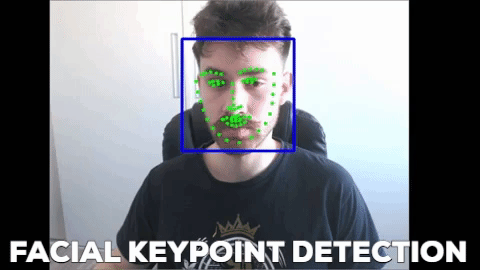

# Facial Keypoint detection (facial-keypoints)

Udacity Computer Vision Nanodegree Project for Keypoint detection using a CNN.

## Getting started

A model pretrained is already available in the directory `saved_models`.
The demo (same as the GIF above) is acessible through `webcam_haar_model.py`

- `$ git clone https://github.com/fabiopk/facial-keypoints`
- `$ cd facial-keypoints`
- `$ python webcam_haar_model.py`

If you want to follow the work, I recommend going thorugh the notebooks in order.
Just make sure you have all dependencies installed (opencv2 is the main one you might not have).

## Known bugs

There is currently a glitch, when the face detected is close to the borders of the image, which may be due to the padding added in general.

